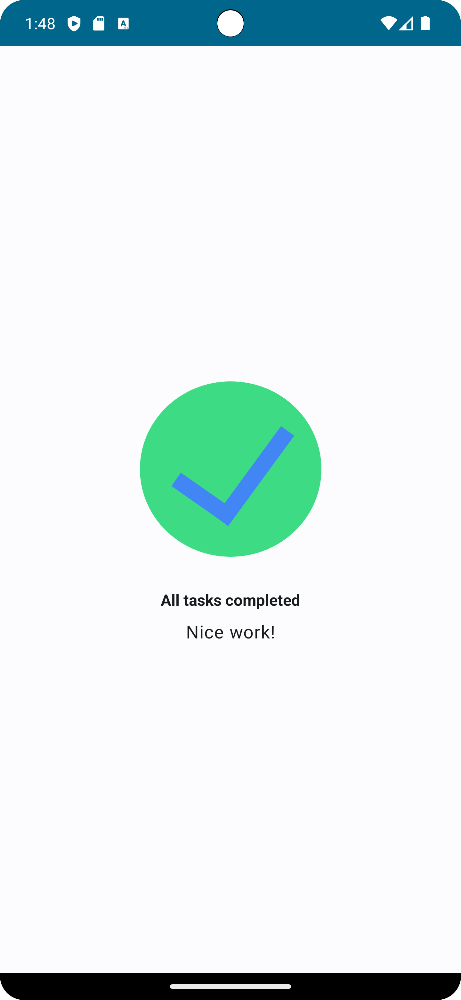

# Task Manager App

A simple app to manage the day-to-day tasks and check the tasks that needs complete using Jetpack Compose components like ```Column```, ```Row```, ```Box```, ```Text```, ```Image```, and ```Modifier```.

<p align="center">
  
</p>